 <h1 align="center">Hello , I'm Sleem Mostafa </h1>
<h4 align="center">Passionate Software Engineer with 3+ years of experience building scalable .NET applications using technologies like .NET Core, Blazor, Redis, EF Core, SignalR, and microservices. Proven ability to deliver maintainable solutions in fast-paced, collaborative environments.
</h4>

 

👨🏻‍💻 **More About Me:**

- 🔭 I’m currently working at **<a href="https://www.softec.ai" target="_blank" rel="noreferrer"> Softec International </a>.**
- 📈 I prioritize clean, scalable, and performance-optimized code.
- 🧠 Always exploring the latest features in .NET.
- ✨ Always experimenting with new technologies.
- 🌱 I’m currently learning Domain-Driven Design and modern design patterns.
- 💬 Ask me about **.Net Core, EF Core.**

# 📊 GitHub Stats

  
  

##  **Languages & Tools:**

 
  
  
  
  
  
  
  
  
  
   

##  **Reach out to me:** ️

  
    
  

